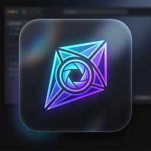

# KyteView 🪁

<p align="center">
  
</p>

<p align="center">
  <b>為 Windows 打造的次世代極速、優雅、零干擾檔案快速預覽神器</b><br>
  <i>超越 macOS QuickLook 的極致流暢體驗 · 毫秒級瞬開 · 智慧避讓 · 側邊釘選</i>
</p>

<p align="center">
  
  
  
  
</p>

---

## 🌟 核心特色

- ⚡ **毫秒級極速預覽**：在 Windows 檔案總管選中任何檔案，按一下 `Space`（空白鍵）即刻彈出預覽，再按一次或按 `ESC` 立即關閉。
- 🧊 **Windows 11 原生美學**：支援 Windows 11 原生 Mica / Acrylic 毛玻璃材質與沉浸式微圓角邊框，完美自適應深色 / 淺色主題。
- 🧠 **智慧視窗避讓 (Smart Offsetting)**：自動偵測檔案總管位置與最大化狀態，預覽視窗自動偏移至對側，絕不遮擋目前選取的檔案與目錄清單。
- 📌 **側邊分割釘選模式 (Pin to Side / Split View)**：按下 `Tab` 鍵將預覽視窗釘選至螢幕右側 1/3，搭配方向鍵快速檢閱整批文件與照片。
- 🔍 **長按微透看穿 (Peek Through)**：預覽期間長按 `Alt` 或 `Ctrl` 鍵，視窗瞬間呈現 15% 半透明，直接穿透看清底層視窗內容。
- 🗜️ **壓縮檔殺手級功能**：
  - 5ms 秒讀 `.zip`, `.7z`, `.rar`, `.tar.gz` 檔頭目錄樹。
  - **單檔拖曳抽出（Drag & Drop Extract）**：選中壓縮檔內檔案，直接拖到桌面或資料夾。
  - **巢狀就地預覽**：按 `Enter` 或雙擊就地預覽包內文字/圖片，按 `Backspace` 隨時返回目錄樹。
- 📊 **Office 簡報與文件免裝 Office 預覽**：
  - **PowerPoint (.pptx)**：優先秒開 2~5ms 封面全彩預覽圖，支援多頁投影片大綱要點瀏覽、16:9 比例畫布與底部翻頁膠囊。
  - **Word (.docx)**：純 Python 轉標準 HTML 渲染，支援標題、表格、粗斜體、列表與圖片。
  - **Excel / CSV (.xlsx, .csv)**：高速解析數萬列資料，自適應深色/淺色高質感表格。
- 🎬 **原生硬體加速影音播放**：
  - 使用微軟原生的 Media Foundation (WMF) GPU 硬解，秒開 `.mp4`, `.mov`, `.webm`, `.mkv`。
  - 空白鍵暫停/播放、左右鍵快轉、懸浮控制列自動隱藏。

---

## 📂 支援檔案格式

| 類別 | 格式 | 渲染核心與特色 |
| :--- | :--- | :--- |
| **簡報文件** | `.pptx`, `.ppt` | 內建縮圖秒開、多頁大綱導航、16:9 比例、舊版 PPT 屬性卡片降級 |
| **文書文件** | `.docx`, `.doc` | Mammoth 輕量 HTML 渲染、排版標籤完整支援、免裝 Office |
| **試算表格** | `.xlsx`, `.xls`, `.csv`, `.tsv` | python-calamine 高速解析、虛擬滾動表格、數值欄位靠右 |
| **電子書文件** | `.pdf` | PyMuPDF 高清向量渲染、平滑縮放、翻頁導航 |
| **標記語言** | `.md`, `.markdown` | Markdown-it-py 渲染、自適應現代 GitHub 風格主題排版 |
| **程式原始碼** | `.py`, `.js`, `.ts`, `.html`, `.css`, `.json`, `.yaml`, `.c`, `.cpp`, `.rs`, `.go` 等 50+ 種 | Pygments 語法高亮、行號顯示、智慧字元編碼偵測（UTF-8, Big5） |
| **壓縮檔案** | `.zip`, `.7z`, `.rar`, `.tar`, `.tar.gz`, `.tar.bz2`, `.tgz` | QTreeView 目錄樹、即時搜尋過濾、**單檔拖曳抽出**、**雙擊巢狀預覽** |
| **影像圖片** | `.png`, `.jpg`, `.jpeg`, `.gif`, `.webp`, `.bmp`, `.ico`, `.svg` | QImageReader 高速載入、1:1 像素清晰呈現或螢幕自適應、動態 GIF 播放 |
| **影音影片** | `.mp4`, `.mov`, `.webm`, `.mkv`, `.avi`, `.flv`, `.ts` | QMediaPlayer WMF 硬體解碼、自適應比例無黑邊、懸浮時間軸 |
| **音訊音樂** | `.mp3`, `.wav`, `.flac`, `.ogg`, `.aac`, `.m4a` | 旋轉唱片封面視覺動效、進度拖曳條、即時時間顯示 |
| **字型檔案** | `.ttf`, `.otf`, `.woff`, `.woff2` | 字型名稱、排版文字瀑布流預覽 (Waterfall) |
| **純文字** | `.txt`, `.log`, `.env`, `.ini`, `.cfg` | 自動編碼識別、極速長文字流暢滾動 |

---

## ⌨️ 快捷鍵一覽

| 快捷鍵 | 功能操作 |
| :--- | :--- |
| `Space`（空白鍵） | 開啟 / 關閉預覽視窗（影片播放時為播放 / 暫停） |
| `ESC` | 立即關閉預覽視窗 |
| `Tab` | 切換 **快速側邊釘選模式 (Pin to Side)** |
| `Alt` / `Ctrl` (長按) | **微透機制 (Peek Through)**：半透明看穿底層檔案總管 |
| `Backspace` | 壓縮檔巢狀預覽時，**返回上一層目錄樹** |
| `Enter` | 壓縮檔樹狀圖中選取檔案就地切入預覽；PPT 卡片中開啟預設程式 |
| `PageUp` / `PageDown` | 簡報 (.pptx) / PDF 檔案切換上一頁 / 下一頁 |
| `Ctrl + ,` | 開啟現代偏好設定視窗 |
| `↑` / `↓` / `←` / `→` | 在檔案總管中切換選取項目，預覽視窗無縫即時切換 |

---

## 🚀 快速開始

### 系統需求
- Windows 10 (1809 以上) 或 Windows 11
- Python 3.10 或更高版本

### 安裝步驟

1. **複製專案庫**：
   ```bash
   git clone https://github.com/your-username/KyteView.git
   cd KyteView
   ```

2. **建立虛擬環境並安裝依賴**：
   ```bash
   python -m venv .venv
   .venv\Scripts\activate
   pip install -r requirements.txt
   ```

3. **啟動 KyteView**：
   ```bash
   python main.py
   ```

---

## 🛠️ 打包與發布

詳細打包指令與步驟請參考 [安裝檔建立前指令.md](安裝檔建立前指令.md)。

---

## 📄 授權條款

本專案採用 [Personal & Non-Commercial License](LICENSE) 條款發布。
原始碼僅供個人學習、研究與檢閱用途。未經授權，嚴格禁止任何形式之商業用途、轉售、重新打包、再發布或散布。商業使用或官方打包版本請向原作者取得正式授權。
